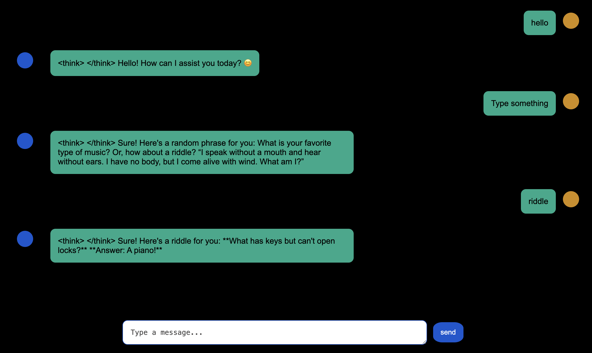

### Local AI Chat App 

A full-stack application that uses a **React** frontend and an **Express.js** backend to interact with a local language model, **DeepSeek-R1:1.5b**, running through **Ollama**. This setup keeps your data private and eliminates API costs.

----



-----

### Prerequisites

Before you begin, make sure you have the following installed on your machine:

  * **Node.js & npm**: [https://nodejs.org/](https://nodejs.org/)
  * **Ollama**: Download and install Ollama for your operating system from the official website: [https://ollama.com/](https://ollama.com/).

After installing Ollama, you must download the specific model used by this application. Open your terminal or command prompt and run the following command to pull the DeepSeek-R1:1.5b model:

```bash
ollama pull deepseek-r1:1.5b
```

This command downloads the model to your local machine, allowing the backend to access it.

-----

### Installation

1.  **Clone the repository**:

    ```bash
    git clone <repository_url>
    cd <repository_name>
    ```

2.  **Install dependencies**: The project is split into a `client` (React) and a `server` (Express) directory.

  * Navigate to the client directory and install dependencies:
    ```bash
    cd frontend
    npm install
    ```
  * Navigate back to the root directory and then into the server directory to install backend dependencies:
    ```bash
    cd ..
    cd backend
    npm install
    ```

-----

### Running the App

The application requires two separate processes to run simultaneously: one for the backend and one for the frontend.

1.  **Start the Ollama server**: Before running the app, ensure the Ollama server is running in the background. If you're on a headless Linux server, you'll need to run this command. If you're using the Ollama desktop app, it should be running automatically.

    ```bash
    ollama serve
    ```

    This command starts the local API server that your Express backend will communicate with. It runs on `http://localhost:11434`.

2.  **Start the backend (Express.js)**:

  * Open a new terminal window.
  * Navigate to the `backend` directory.
  * Run the server:
    ```bash
    npm start
    ```

The server will run on `http://localhost:3001` (or the port specified in your configuration).

3.  **Start the frontend (React)**:

  * Open another new terminal window.
  * Navigate to the `frontend` directory.
  * Run the frontend:
    ```bash
    npm start
    ```

    This will open the application in your web browser at `http://localhost:3000`. If it doesn't open automatically, navigate there manually.

You can now interact with the local AI model through the web interface.
