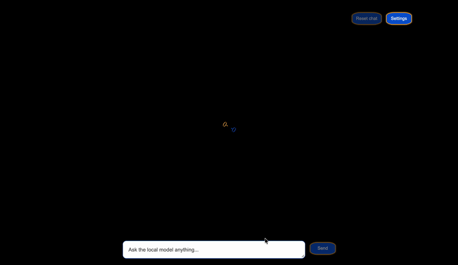

# Local AI Chat App

A full-stack local chatbot that uses a React frontend, an Express backend, and an Ollama model running on your own computer. The app sends chat prompts to your local Ollama server, so no paid API key is required.

## Screenshots

Demo:



## Tech Stack

- React 18
- Vite
- Express 5
- Ollama
- DeepSeek-R1 1.5B by default

## Features

- Local chat UI for Ollama models
- Configurable backend port, Ollama URL, default model, and temperature
- Configurable frontend API URL
- Model selector
- Temperature slider
- Optional system prompt box
- Streaming responses from Ollama's chat API
- Real system prompts sent as chat messages
- Saved chat history in browser local storage
- Reset chat button
- Loading animation and visible error messages

## Requirements

- Node.js and npm
- Ollama installed and running
- The required default model:

```bash
ollama pull deepseek-r1:1.5b
```

If you choose another model in the UI, pull it first. For example:

```bash
ollama pull llama3.2:3b
```

## Setup

Install backend dependencies:

```bash
cd chatbot-project/backend
npm install
```

Install frontend dependencies:

```bash
cd ../frontend
npm install
```

Create backend environment config:

```bash
cd ../backend
cp .env.example .env
```

Backend `.env` values:

```bash
PORT=3001
OLLAMA_URL=http://localhost:11434
OLLAMA_MODEL=deepseek-r1:1.5b
OLLAMA_TEMPERATURE=0.7
```

Create frontend environment config:

```bash
cd ../frontend
cp .env.example .env
```

Frontend `.env` values:

```bash
VITE_API_URL=http://localhost:3001
```

## Run The App

Start Ollama:

```bash
ollama serve
```

Start the backend in another terminal:

```bash
cd chatbot-project/backend
npm start
```

Start the frontend in another terminal:

```bash
cd chatbot-project/frontend
npm run dev
```

Open the Vite URL shown in the terminal, usually:

```text
http://localhost:5173
```

## Project Structure

```text
chatbot-project/
  backend/
    config.js
    server.js
    routes/
      chatRoutes.js
    services/
      ollamaService.js
    .env.example
    package.json
  frontend/
    src/
      App.jsx
      components/
    .env.example
    package.json
```

## Screenshot Prep

The README displays the demo GIF at `width="720"` so it stays readable without taking over the page.

## Future Improvements

- Load installed Ollama models dynamically.
- Add chat sessions and export/import.
- Add markdown rendering for model replies.
- Add conversation memory with summarization.
- Add backend tests and frontend component tests.
